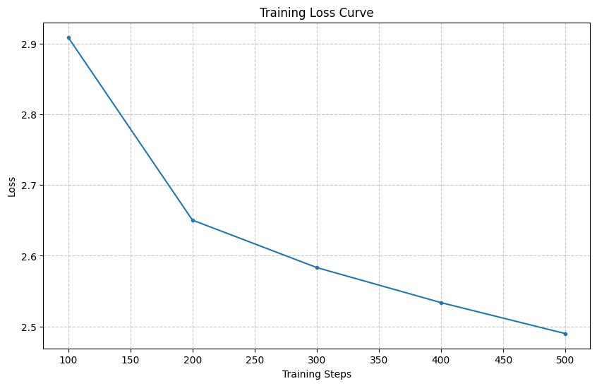
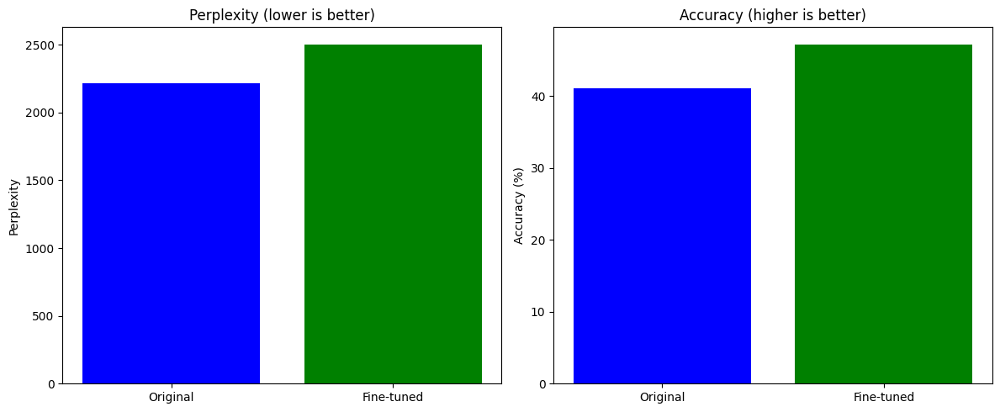

# Large Language Model Fine-tuning with Limited Resources

## Project Description
This project focuses on the efficient fine-tuning of a pre-trained large language model (LLM) using advanced techniques like Low-Rank Adaptation (LoRA) and 4-bit Quantization. The primary goal was to enhance the model's text generation capabilities on a specific dataset while successfully navigating the constraints of limited GPU resources. The project demonstrates an end-to-end pipeline from data preparation and model selection to training, quantitative, and qualitative evaluation.

## Learning Outcomes
*   Gained hands-on experience with the Hugging Face `transformers` and `peft` libraries for efficient LLM fine-tuning.
*   Analyzed the impact of fine-tuning on model performance through both perplexity/accuracy metrics and human evaluation.
*   Mastered techniques for training LLMs with minimal GPU resources, specifically Low-Rank Adaptation (LoRA) and 4-bit Quantization.

## Features & Technologies Used
*   **Model:** `meta-llama/Llama-3.2-1B` (~1.2 Billion parameters)
*   **Frameworks:** PyTorch, Hugging Face `transformers`, Hugging Face `datasets`, `peft` (Parameter-Efficient Fine-tuning), `bitsandbytes`
*   **Techniques:** Low-Rank Adaptation (LoRA), 4-bit Quantization, Gradient Checkpointing
*   **Dataset:** `wikitext-2-raw-v1`
*   **Compute:** Google Colab T4 GPU
*   **Languages:** Python

## Model Selection & Fine-Tuning

### 1. Model Selection
A ~1.2 Billion parameter model, `meta-llama/Llama-3.2-1B`, was selected from Hugging Face. This model was chosen for its parameter count (fitting the ~1B requirement) and its pre-trained nature, requiring fine-tuning rather than being pre-fine-tuned for a specific task.

### 2. Data Preparation
The `wikitext-2-raw-v1` dataset was loaded from the Hugging Face `datasets` library. Due to computational constraints, a manageable portion of the dataset was used for fine-tuning. The data was preprocessed, including tokenization, setting `tokenizer.pad_token = tokenizer.eos_token`.

### 3. Efficient Model Loading (4-bit Quantization)
The `Llama-3.2-1B` model was loaded with 4-bit quantization using `bitsandbytes`, significantly reducing its memory footprint. This was critical for fitting the model into the limited VRAM of the Colab T4 GPU.

```python
model = AutoModelForCausalLM.from_pretrained(
    model_name,
    quantization_config={"load_in_4bit": True,
                         "bnb_4bit_compute_dtype": torch.bfloat16},
    device_map="auto",
)
model = prepare_model_for_kbit_training(model) # Prepares model for kbit training
```
### 4. LoRA Configuration
Low-Rank Adaptation (LoRA) was applied to the model to enable parameter-efficient fine-tuning. This technique updates only a small fraction of the model's parameters, drastically reducing training costs and memory usage while maintaining performance.
lora_config = LoraConfig(
    r=8,  # rank dimension
    lora_alpha=32,  # parameter for scaling
    target_modules=["q_proj", "k_proj", "v_proj", "o_proj"], # LoRA applied to attention projections
    lora_dropout=0.05,
    bias="none",
    task_type=TaskType.CAUSAL_LM
)
model = get_peft_model(model, lora_config)
print(f"Trainable parameters: {model.print_trainable_parameters()}")
# Output: trainable params: 1,703,936 || all params: 1,237,518,336 || trainable%: 0.1377

This configuration resulted in approximately 1.7 Million trainable parameters, representing only ~0.14% of the total model parameters.

### 5. Training Environment & Hyperparameters
The model was fine-tuned on a Google Colab T4 GPU. Key training hyperparameters were defined:
Batch Size: 4  (to fit GPU memory)
Learning Rate: 2e-4
Epochs: 3
The Hugging Face Trainer API was utilized, and gradient checkpointing (use_cache=False) was enabled to further optimize memory.

## Evaluation
### 1. Quantitative Evaluation
Both the original pre-trained Llama-3.2-1B model and the fine-tuned model were evaluated on a held-out validation set using standard language modeling metrics: Perplexity and Accuracy.<br>
Results:
Original Model - Perplexity: 2213.88, Accuracy: 41.03%
Fine-tuned Model - Perplexity: 2504.42, Accuracy: 47.19%
Improvement - Perplexity: -290.54, Accuracy: +6.16% <br>
Analysis:
The fine-tuned model demonstrated a clear +6.16% improvement in token prediction accuracy, indicating it is better at predicting correct tokens relevant to the dataset. While perplexity increased, this often suggests a trade-off where the model becomes more specialized (and thus less "general" in its predictions) but more accurate on the target task.<br><br>
Training Loss Curve:
<br><br>
Quantitative Evaluation Results (Accuracy/Perplexity):


### 2. Qualitative Evaluation (Human Assessment)
10 sample outputs were generated from both the pre-trained and fine-tuned models based on diverse prompts. These outputs were manually evaluated for fluency, relevance, and correctness (human evaluation).
Key Observations:
The fine-tuned model's outputs generally showed:
Improved Relevance: Outputs were more aligned with factual information or common knowledge expected from the prompts.
Better Coherence: Sentences flowed more logically, and the text felt more grounded.
Reduced Hallucinations: While not entirely eliminated, the fine-tuned model exhibited fewer outright incorrect or nonsensical statements compared to the base model.

**Prompt: The capital city of France, Paris, is known for**

*   **Original Model Output:** The capital city of France, Paris, is known for being the most expensive place to live in. It is also one of the largest cities in the world... (less factually accurate/relevant)
*   **Fine-tuned Model Output:** The capital city of France, Paris, is known for its culture, art, and fashion. It was also the home of the Louvre Museum, which houses the Mona Lisa... (more factually accurate/relevant)

## Results & Conclusion
This project successfully demonstrated that large language models can be effectively fine-tuned even with highly constrained computational resources, thanks to techniques like LoRA and 4-bit Quantization. The fine-tuned Llama-3.2-1B model showed a notable 6.16% improvement in token prediction accuracy and produced qualitatively superior text generations compared to its base counterpart. The methods employed were critical in achieving training feasibility on a single Google Colab T4 GPU, which would have been impossible with standard full fine-tuning approaches.